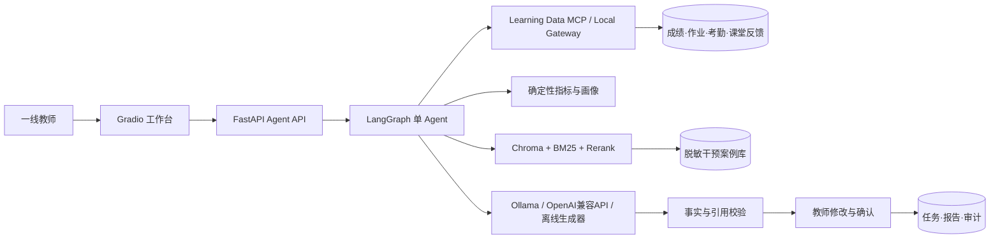

# 基于多源学情数据与案例增强生成的学生学情分析 Agent

面向一线教师的单学生学情分析系统。它从成绩、作业、考勤和课堂反馈中计算可复现的学习指标，构建结构化画像，通过案例 RAG 检索相似干预经验，生成带证据引用的报告，并在事实校验和教师确认后完成闭环。

项目业务语境参考湖南未来教育科技集团有限公司的多校区教育培训工作流。仓库仅使用脱敏模拟数据和独立实现的通用工程代码，不包含公司真实学生数据、内部源代码、密钥或专有接口；功能边界不包含教研资料查询、班级聚合分析或多角色权限等非核心能力。

## 核心能力

- LangGraph 显式状态机：支持正常、澄清、越权、数据不足、校验重试和等待确认分支；
- 多源学情数据：SQLite Demo 数据，所有查询执行教师—学生对象级权限校验；
- Learning Data MCP：真实 FastMCP stdio Server 和 Client Adapter，教师身份由受信任连接上下文注入；
- 确定性计算：标准化成绩趋势、班级均分差、排名百分位、作业、订正、考勤、薄弱知识点和数据完整度；
- 案例 RAG：Chroma 持久向量索引、BM25、年级/学科元数据过滤和画像规则重排；
- 可靠报告：Pydantic 结构化输出、数值/趋势/引用/隐私/不当标签校验、无案例降级；
- 人在回路：教师可查看证据、修改后重新校验，只有确认后任务才会进入 `completed`；
- 工程闭环：FastAPI、后台任务、SQLite 状态持久化、审计事件、JSON 日志、运行指标、教师易读报告工作台、Docker Compose 和离线评测。

## 架构



这是一个单 Agent 项目。MCP Server 是外部数据能力边界，不是第二个 Agent；指标、画像、RAG 和校验均为可测试的确定性内部节点。

## 克隆后用 Docker 一键启动

另一台电脑只需安装 Git 和 Docker Desktop（Windows、macOS 或 Linux Docker
Engine），不需要预装 Python。首次启动步骤：

```bash
git clone https://github.com/IrevenQWER/-Agent.git
cd ./-Agent
cp .env.example .env
docker compose up -d --build
```

然后访问：

- 教师工作台：<http://127.0.0.1:7860>
- API 文档：<http://127.0.0.1:8000/docs>

默认是 `deterministic` 模式，不配置密钥也能完成全部业务演示。Demo 教师编号为
`T1001`，推荐请求为：

```text
生成学生 S1001 2026年3月数学学情报告，重点看成绩和作业
```

### 配置 OpenAI 兼容模型 API

编辑本地 `.env`：

```dotenv
APP_MODEL_PROVIDER=openai
APP_MODEL_NAME=你的模型名称
APP_MODEL_BASE_URL=https://你的服务地址/v1
APP_MODEL_API_KEY=你的API密钥
```

接口需要兼容 `POST /v1/chat/completions`。OpenAI、兼容 OpenAI 协议的云模型服务，
以及提供该协议的自建网关均可接入。修改配置后重建 API 容器：

```bash
docker compose up -d --force-recreate
```

真实密钥只写在 `.env`；该文件已被 `.gitignore` 排除，不会上传 GitHub。

### 配置本机 Ollama

先安装 Ollama 并拉取模型，然后把 `.env` 改为：

```dotenv
APP_MODEL_PROVIDER=ollama
APP_MODEL_NAME=qwen3:8b
APP_MODEL_BASE_URL=http://host.docker.internal:11434
APP_MODEL_API_KEY=
```

执行：

```bash
docker compose up -d --force-recreate
```

查看运行状态和日志：

```bash
docker compose ps
docker compose logs -f api
```

可选：本机有 Python/httpx 时执行完整安装验收：

```bash
python scripts/verify_install.py
```

停止服务但保留报告数据：

```bash
docker compose down
```

## Python 本地启动（可选）

要求 Python 3.11–3.13。以下示例使用 Python 3.12：

```bash
python3.12 -m venv .venv
source .venv/bin/activate
pip install -e '.[rag,ui,dev]'
futureedu-seed
futureedu-api
```

另开终端启动教师工作台：

```bash
source .venv/bin/activate
futureedu-ui
```

也可以在 API 启动后运行完整命令行演示：

```bash
python scripts/demo_workflow.py
```

- API 文档：<http://127.0.0.1:8000/docs>
- 教师工作台：<http://127.0.0.1:7860>
- Demo 教师：`T1001`
- 可访问学生：`S1001`、`S1002`

默认使用 `deterministic` 报告生成器，保证离线演示稳定。若不使用 Docker且本机有 Ollama，可在 `.env` 中配置：

```dotenv
APP_MODEL_PROVIDER=ollama
APP_MODEL_NAME=qwen3:8b
APP_MODEL_BASE_URL=http://127.0.0.1:11434
```

Ollama 模式采用“确定性事实骨架 + 模型叙述增强”：成绩指标、证据 ID、案例建议和
置信度由程序生成并锁定，模型只返回两个无数字叙述字段，随后仍执行完整事实校验。
这样可以使用本地小模型，同时避免模型删改证据或把正负指标解释反向。

## API 闭环示例

Demo 用 `X-Teacher-ID` 模拟上游网关注入的可信认证身份。生产环境必须由真实 SSO/API Gateway 校验并覆盖该请求头。

```bash
curl -X POST http://127.0.0.1:8000/api/v1/analysis/tasks \
  -H 'Content-Type: application/json' \
  -H 'X-Teacher-ID: T1001' \
  -d '{"query":"生成学生 S1001 2026年3月数学学情报告","session_id":"DEMO-001"}'
```

随后使用返回的 `task_id` 查询状态。报告通过校验后状态为 `awaiting_confirmation`，调用确认接口后才变为 `completed`。

确认后的报告可通过 `GET /api/v1/reports/{report_id}/export?format=markdown` 导出；未确认报告会返回 409。

## MCP 模式

默认 API 使用本地 Gateway，以便快速演示。切换为真实 stdio MCP 数据链路：

```dotenv
APP_LEARNING_DATA_BACKEND=mcp_stdio
```

MCP Server 暴露学生解析、脱敏档案、成绩、作业、考勤和课堂反馈工具。身份通过服务进程的受信任环境绑定，不作为模型可编辑的工具入参。自动化测试会启动真实 MCP 子进程验证协议链路。

## 测试与评测

```bash
pytest Tests/unit Tests/integration Tests/e2e -q
ruff check src Tests/unit Tests/integration Tests/e2e
futureedu-eval --output runtime/eval-results.json
```

当前共有 47 个自动化测试，覆盖率为 86%；其中包含真实 stdio MCP 子进程、API 完整闭环、Ollama/OpenAI 兼容模型网关、本地模型稀疏/错误结构化输出的事实骨架修复测试，以及教师易读报告、家长反馈摘要与 UI 状态提示测试。固定版案例评测集共 5 条人工标注查询，实测 `Recall@3 = 1.00`、`MRR = 1.00`。数据集较小，因此该指标仅作为工程回归门禁，不代表线上泛化效果。完整结果写入 `runtime/eval-results.json`。

## Docker Compose

```bash
docker compose up --build
```

Docker Desktop 访问宿主机 Ollama 时可运行：

```bash
APP_MODEL_PROVIDER=ollama APP_MODEL_NAME=qwen3:8b \
APP_MODEL_BASE_URL=http://host.docker.internal:11434 docker compose up --build
```

启动后访问 8000 端口的 API 和 7860 端口的工作台。Compose 默认使用稳定的离线生成器和本地 Gateway；MCP 协议链路通过集成测试和本地配置演示。

## 代码结构

```text
src/futureedu_insight/
├── agent/          # LangGraph、请求解析、报告生成
├── api/            # FastAPI 与 API Schema
├── adapters/       # SQLite / MCP 双适配器
├── domain/         # 严格领域模型与错误类型
├── evaluation/     # Recall@K、MRR、延迟评测
├── gateways/       # 协议无关接口
├── infrastructure/ # 数据、状态、Prompt、观测
├── rag/            # 案例库、Chroma、BM25、重排
├── services/       # 任务与教师确认用例
├── tools/          # 指标、画像、事实校验
└── ui/             # Gradio 教师工作台
```

详细需求、架构决策、数据模型与验收标准见 [项目详细设计文档](docs/学生学情分析Agent项目详细设计文档.md)，面试表达与演示顺序见 [简历与面试说明](docs/简历与面试说明.md)。

## 可用于简历的项目描述

> 设计并实现面向一线教师的单学生学情分析 Agent，使用 LangGraph 编排多源数据查询、确定性指标计算、学习画像、案例 RAG、报告生成、事实校验与教师确认流程；通过统一 Gateway 实现 SQLite/MCP 双适配，使用 Chroma + BM25 + 元数据过滤完成混合检索，并实现对象级权限控制、证据追溯、任务持久化、审计日志及 FastAPI/Gradio 演示闭环。固定 5 条标注案例评测集上 Recall@3 与 MRR 均为 1.00。

简历中的评测数据应同时注明测试集规模，避免把小规模 Demo 指标表述为生产效果。
