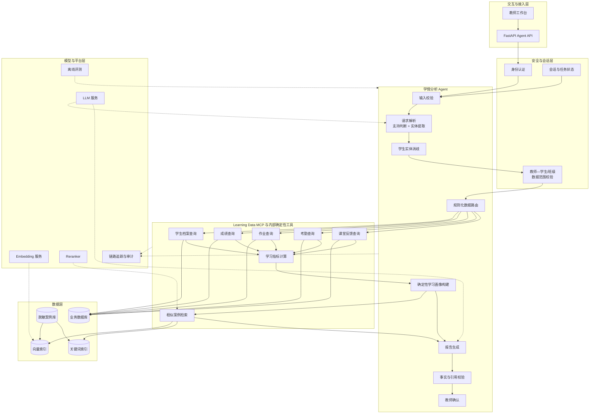
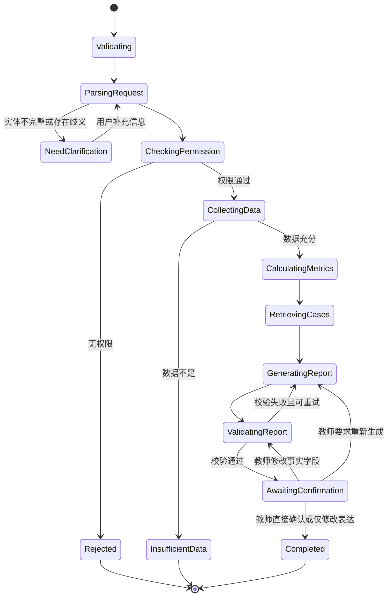
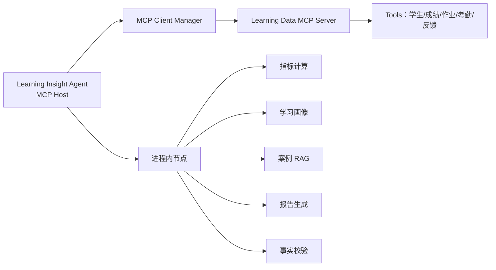
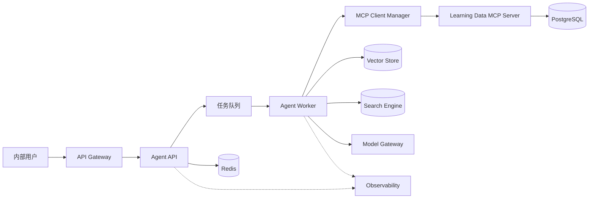

# FutureEdu Learning Insight

## 基于多源学情数据与案例增强生成的学生学情分析 Agent

> 文档类型：项目详细设计文档  
> 当前版本：V1.0  
> 项目阶段：V1 已实现并通过自动化与真实进程验证  
> 适用对象：产品、Agent 工程、后端工程、测试、教学运营及技术面试展示

---

## 1. 文档说明

### 1.1 编写目的

本文档用于定义“基于多源学情数据与案例增强生成的学生学情分析 Agent”的业务范围、系统架构、Agent 工作流、数据模型、工具协议、案例 RAG、报告生成、权限安全、评测体系、测试方案和实施计划。

本文档既可作为项目改造依据，也可拆分为后续的 README、接口文档、测试方案和项目演示材料。

### 1.2 项目定位

本项目只面向教育培训机构的一线教师和班主任。两类人员统一为“教师用户”，使用相同功能、相同操作权限和相同的数据范围规则。系统通过 Agent 聚合学生成绩、作业、考勤和课堂反馈等多源数据，计算结构化学习指标，检索经过审核的相似历史学情案例，生成带事实依据、案例引用和干预建议的阶段学情报告。

项目不是通用教育问答机器人，也不替代现有教研资料系统。案例 RAG 只作为学情诊断和干预建议的增强模块，不对外提供独立的教研资料查询入口。

### 1.3 当前实现基线（2026-08-09）

当前仓库已实现本文档定义的 V1 主闭环，包括多源数据查询、对象级权限、LangGraph 状态机、Learning Data MCP、本地/MCP 双适配器、确定性指标与画像、Chroma + BM25 案例检索、结构化报告、事实校验、任务持久化、教师修改确认、证据查询与报告导出、FastAPI、Gradio、审计日志和离线评测。

为保证 Demo 可独立运行，当前实现与类生产建议存在以下明确差异：

- 默认使用 FastAPI BackgroundTasks，而不是 Redis + Celery；
- 默认使用确定性哈希向量，可替换为 BGE-M3，Chroma 负责持久索引；
- 默认使用 SQLite，生产环境建议替换为 PostgreSQL；
- Demo 通过 `X-Teacher-ID` 模拟上游网关的可信身份，生产环境必须接入 SSO/API Gateway；
- 默认使用离线确定性报告生成器，也提供 Ollama JSON Schema 结构化生成网关；
- API 默认使用本地数据适配器，可通过配置切换真实 stdio MCP 链路。

简历和演示只描述已实现能力，不将上述类生产演进项表述为当前线上能力。

### 1.4 核心原则

1. 学生事实来自业务系统，不由大模型生成。
2. 平均分、变化率和提交率等指标由确定性程序计算。
3. RAG 只提供相似案例和干预经验，不改变当前学生事实。
4. 权限判断由后端执行，不交给大模型决策。
5. 所有报告必须经过事实校验，并由发起任务的教师确认后完成。
6. 数据不足时明确说明，不通过模型猜测补全。
7. 项目优先保证可追溯、可评测和可解释，而非追求完全自治。

---

## 2. 业务背景与问题定义

### 2.1 业务背景

在多校区教育培训场景中，一线教师和班主任通常需要定期向学生及家长反馈学习情况。相关信息可能分散在成绩系统、作业系统、考勤系统、课堂评价记录和教师个人记录中。

本项目的业务语境参考湖南未来教育科技集团有限公司的多校区教育培训工作流。仓库仅使用脱敏模拟数据和重新实现的通用工程代码，不包含公司真实学生数据、内部源代码、密钥或专有接口。

传统学情报告存在以下问题：

- 数据来源分散，人工汇总耗时；
- 报告质量依赖教师个人经验；
- 描述容易停留在分数层面，缺少过程性分析；
- 历史干预经验及其观察结果无法规模化复用；
- 报告中的数字、结论和建议缺少明确依据；
- 不同教师生成的报告格式和分析标准不统一；
- 教师与学生、班级之间的数据访问关系缺少统一约束。

### 2.2 目标问题

系统重点解决以下问题：

1. 如何通过自然语言快速发起单个学生的学情分析任务；
2. 如何聚合成绩、作业、考勤和课堂反馈等多源数据；
3. 如何通过确定性算法形成稳定、可解释的学习指标；
4. 如何检索与当前学习画像相似且具有可观察干预结果的历史案例；
5. 如何生成有事实依据、有案例引用的学情报告；
6. 如何识别报告中的数字幻觉和无依据结论；
7. 如何保证教师只能访问其授权范围内的学生数据。

### 2.3 项目目标

#### 业务目标

- 降低教师汇总学情数据和撰写报告的时间成本；
- 提升不同教师生成报告的一致性；
- 复用机构内部经过审核并具有观察证据的干预经验；
- 为教师提供可确认、可修改、可追溯的报告生产过程；
- 按教师需要生成专业、克制且有证据的家长沟通内容草稿。

#### 技术目标

- 构建单 Agent、多工具、有状态的任务工作流；
- 支持结构化数据查询与非结构化案例检索；
- 实现 Case-based RAG；
- 使用结构化输出约束工具参数和报告格式；
- 建立事实校验、权限控制、可观测性和离线评测；
- 支持模型、Embedding、向量库及业务数据源替换。

### 2.4 非目标

V1 不包含以下功能：

- 通用教研资料问答；
- 班级聚合分析、班级报告和重点学生自动筛选；
- 题目讲解和自动批改；
- 招生咨询和线索转化；
- 自动向家长发送报告；
- 自动决定学生分班、升降班或退费；
- 对学生能力、性格或心理状态作自动定性；
- 使用未经审核的互联网内容直接生成教学建议；
- 让模型直接访问生产数据库并执行任意 SQL。

---

## 3. 用户与数据范围

### 3.1 教师用户

一线教师和班主任在本系统中不区分角色，统一称为“教师用户”。两者拥有完全一致的产品功能和操作权限：

- 查看与本人存在授权关系的学生和班级；
- 生成单个学生的学情报告；
- 查看报告使用的数据证据和案例引用；
- 修改、确认和导出本人发起的报告。

系统不根据“一线教师”或“班主任”名称建立不同菜单、不同 Agent 流程或不同工具集合。

### 3.2 数据范围规则

虽然不区分教师角色，但仍需执行数据范围校验。数据访问范围由教师与学生、班级之间的授权关系决定：

- 教师只能访问与本人直接关联，或位于本人授权班级中的学生；
- 同一教师可以同时关联多个班级；
- 授权关系由上游教务系统提供，Agent 不自行推断；
- 前端传入的 `teacher_id`、`student_id` 不能直接作为授权结论；
- 使用姓名等模糊标识进行学生消歧时，只能在当前教师已授权的学生名册中搜索，避免候选结果泄露其他学生信息；
- 数据查询工具必须根据认证上下文再次校验教师与目标对象的关联关系。

这属于对象级数据访问控制，不属于角色差异化权限设计。

### 3.3 非业务操作

模型配置、案例入库审核、索引构建和日志运维属于系统后台或离线运维流程，不作为本项目面向教师用户的产品功能，也不在 Agent 对话中暴露。

---

## 4. 典型使用场景

### 4.1 个人阶段学情报告

教师输入：

> 生成学生 S1001 今年春季前四周的数学学情报告，重点分析成绩变化和作业情况。

系统执行：

1. 提取学生、学科和时间范围；
2. 校验教师是否有权访问 S1001；
3. 查询学生档案、成绩、作业、考勤和课堂反馈；
4. 计算成绩趋势、作业提交率、订正率等指标；
5. 通过确定性规则构建结构化学习画像；
6. 检索具有相似特征和观察结果的历史案例；
7. 生成报告和干预建议；
8. 校验报告数字、结论和引用；
9. 交给发起任务的教师确认。

### 4.2 数据不足

教师输入：

> 生成张同学最近的学情报告。

如果同名学生较多或“最近”范围不明确，系统应返回候选项或请求补充信息，而不是随机选择学生。

### 4.3 越权访问

当教师请求查看非本人班级且没有授权的学生时，系统在查询业务数据之前终止任务，返回权限不足，不将越权请求发送给大模型。

---

## 5. 总体架构



---

## 6. Agent 设计

### 6.1 Agent 类型

本项目采用单 Agent 架构。唯一的“学情分析 Agent”负责任务理解、状态管理和工具编排。成绩查询、作业查询、案例检索和报告校验是工具或工作流节点，不定义为独立 Agent。

采用单 Agent 的原因：

- 业务目标单一，围绕学情报告生成展开；
- 工具职责明确，不需要多个 Agent 角色长期自治；
- 数据一致性和权限要求高，确定性工作流更可靠；
- 便于测试每个节点输入输出；
- 与已有招生多 Agent 项目形成技术差异。

### 6.2 Agent 状态

建议定义统一任务状态：

```python
class LearningAnalysisState(TypedDict):
    request_id: str
    session_id: str
    teacher_context: TeacherExecutionContext
    original_query: str
    parsed_request: ParsedAnalysisRequest | None
    permission_result: PermissionResult | None
    student_profile: StudentProfile | None
    score_records: list[ScoreRecord]
    homework_records: list[HomeworkRecord]
    attendance_records: list[AttendanceRecord]
    classroom_feedback: list[ClassroomFeedback]
    learning_metrics: LearningMetrics | None
    learning_profile: LearningProfile | None
    retrieved_cases: list[RetrievedCase]
    report: LearningReport | None
    validation_result: ReportValidationResult | None
    confirmation_status: str | None
    errors: list[WorkflowError]
    retry_count: int
```

### 6.3 工作流节点

| 节点 | 类型 | 主要职责 |
|---|---|---|
| InputValidation | 确定性 | 校验输入长度、字符和请求字段 |
| RequestParsing | LLM + Schema | 一次完成支持判断，并提取学生、可选班级上下文、学科、时间范围和分析重点 |
| EntityResolution | 确定性 | 仅在当前教师已授权名册中，将姓名等模糊实体解析为业务 ID |
| PermissionCheck | 确定性 | 校验教师是否有权访问目标学生 |
| DataRouting | 确定性规则 | 根据分析重点映射所需数据工具，不使用 LLM 自由规划 |
| DataCollection | 工具并发 | 查询多源学情数据 |
| DataSufficiency | 确定性 | 判断数据是否足以生成报告 |
| MetricCalculation | 确定性 | 计算趋势、比率和异常指标 |
| ProfileBuilding | 确定性规则 | 根据指标阈值和标签映射构建可复现的结构化学习画像 |
| CaseRetrieval | RAG | 检索具有相似特征和观察结果的案例 |
| ReportGeneration | LLM + Schema | 生成结构化报告 |
| FactValidation | 确定性 | 校验数字、趋势和引用，并判断教师修改后是否需要再次校验 |
| TeacherConfirmation | 人工 | 发起任务的教师确认或修改报告 |

#### 6.3.1 请求解析输出

`RequestParsing` 合并原意图识别和实体提取，只调用一次模型并输出：

```json
{
  "supported": true,
  "student_identifier": "S1001",
  "class_context": null,
  "subject": "数学",
  "start_date": "2026-03-01",
  "end_date": "2026-04-30",
  "analysis_focus": ["成绩", "作业"],
  "include_parent_summary": false
}
```

`supported=false` 时同时返回不支持原因；实体不完整或存在歧义时进入补充信息流程。

#### 6.3.2 规则化数据路由

数据路由不由 LLM 自由规划，而是根据 `analysis_focus` 进行白名单映射：

```python
TOOL_MAPPING = {
    "成绩": ["get_score_records"],
    "作业": ["get_homework_records"],
    "考勤": ["get_attendance_records"],
    "课堂表现": ["get_classroom_feedback"],
    "综合": [
        "get_score_records",
        "get_homework_records",
        "get_attendance_records",
        "get_classroom_feedback",
    ],
}
```

学生档案属于所有任务的公共上下文，始终查询；多个数据工具可以并行调用。

### 6.4 状态转换



### 6.5 终止条件

任务在以下条件终止：

- 正常生成并通过教师确认；
- 权限校验失败；
- 必要实体无法消歧；
- 核心数据不足；
- 工具重试超过上限；
- 报告事实校验连续失败；
- 请求被用户取消。

每个任务必须配置最大节点执行次数和最大模型调用次数，避免无限循环。

---

## 7. 工具设计

### 7.1 工具通用规范

每个工具应满足：

- 输入和输出使用 Pydantic 模型；
- 不接受模型生成的任意 SQL；
- 教师身份从受信任执行上下文注入，不作为 LLM 可填写的工具参数；
- 内部执行数据范围校验；
- 设置超时、重试上限和错误类型；
- 返回 `source_record_ids` 供报告引用；
- 日志默认不记录完整学生敏感信息；
- 对“数据为空”和“系统错误”进行区分。

统一响应：

```python
from typing import Any, Generic, TypeVar

from pydantic import BaseModel, Field

T = TypeVar("T")


class ToolResult(BaseModel, Generic[T]):
    success: bool
    data: T | None = None
    error_code: str | None = None
    error_message: str | None = None
    source_record_ids: list[str] = Field(default_factory=list)
    metadata: dict[str, Any] = Field(default_factory=dict)
```

### 7.2 GetStudentProfile

输入：

```json
{
  "student_id": "S1001"
}
```

教师身份不属于模型可见工具参数，由 Agent API 的认证上下文注入，例如 `execution_context.authenticated_teacher_id`。输出包含学生脱敏档案、年级、班级、校区和授权关系，不向模型暴露手机号、身份证和家庭地址。

### 7.3 GetScoreRecords

输入字段：

- `student_id`；
- `subject`；
- `start_date`；
- `end_date`；
- `exam_types`，可选。

输出字段：

- 考试名称与日期；
- 学生分数；
- 满分；
- 班级均分；
- 排名及参加人数；
- 知识点得分率；
- 原始记录 ID。

### 7.4 GetHomeworkRecords

输出作业提交状态、正确率、订正状态、知识点标签和教师反馈摘要。

### 7.5 GetAttendanceRecords

输出应到课次数、实际到课次数、迟到、请假、缺勤和连续异常情况。

### 7.6 GetClassroomFeedback

查询教师结构化标签和课堂文字反馈。原始自由文本应在进入模型前进行敏感信息过滤。

### 7.7 CalculateLearningMetrics

该工具由确定性 Python 代码实现，不调用 LLM。

建议计算：

- 标准化成绩；
- 相邻考试分数变化；
- 时间窗口趋势斜率；
- 班级均分差；
- 排名百分位变化；
- 作业提交率；
- 作业正确率；
- 错题订正率；
- 到课率；
- 薄弱知识点频次；
- 连续异常次数；
- 数据完整度。

变化率必须处理分母为零、考试满分不同和缺失值情况。

### 7.8 RetrieveSimilarLearningCases

输入：结构化学习画像、元数据过滤条件、Top-K。  
输出：案例 ID、相似原因、干预策略、干预前后观察结果、证据质量、适用条件、不适用条件、检索分数和引用片段。

### 7.9 ValidateReportFacts

校验范围：

- 报告中的每个具体数字是否来自业务记录或计算结果；
- “上升、下降、连续”等趋势描述是否与指标一致；
- 引用的案例 ID 是否真实存在；
- 干预建议是否受到案例内容支持；
- 报告是否包含越权字段；
- 是否出现禁止的绝对化能力定性。

### 7.10 MCP 技术决策

#### 7.10.1 是否所有工具都使用 MCP

不需要。MCP 解决的是 AI 应用与外部能力之间的标准化发现、调用和上下文交换问题，不是 Agent 内部每个函数都必须采用的调用方式。

本项目 V1 采用“内部确定性节点 + Learning Data MCP 工具 + 进程内案例 RAG”的混合架构：

| 能力 | 推荐实现 | 原因 |
|---|---|---|
| 输入校验 | 进程内函数 | 延迟低、规则固定，不需要被其他 AI 客户端发现 |
| 请求解析 | Agent 节点 | 一次完成支持判断和实体提取，属于工作流内部推理过程 |
| 学习指标计算 | 进程内确定性工具 | 涉及核心计算规则，应便于单元测试和版本控制 |
| 学习画像构建 | 进程内确定性节点 | 依赖当前任务指标，并要求稳定、可复现 |
| 报告生成 | Agent 节点 | 属于系统核心编排逻辑 |
| 事实校验 | 进程内确定性工具 | 需要低延迟，并与报告 Schema 紧密耦合 |
| 学生档案、成绩、作业、考勤和课堂反馈查询 | V1 MCP 工具 | 属于外部教务数据能力，通过统一协议屏蔽数据源差异 |
| 相似案例检索 | V1 进程内 RAG；V2 MCP 候选 | V1 与 Agent 同库部署；出现跨应用复用需求后再独立服务化 |

#### 7.10.2 推荐的 MCP 边界

V1 只建设一个边界清晰的 `Learning Data MCP Server`：

```text
Learning Insight Agent（MCP Host / Client）
└── Learning Data MCP Server
    ├── get_student_profile
    ├── get_score_records
    ├── get_homework_records
    ├── get_attendance_records
    └── get_classroom_feedback
```

`Learning Data MCP Server` 负责屏蔽不同教务系统的接口差异，并在服务内部执行数据范围校验。案例 RAG 在 V1 保留于 Agent 服务内部；只有案例检索需要被其他 Agent 或 AI 应用复用时，V2 才拆分 `Learning Case MCP Server`。

指标计算、报告生成和事实校验不通过 MCP 暴露，避免把一个完整应用拆成大量低价值远程调用。



#### 7.10.3 V1 与演进策略

推荐按以下顺序实施：

1. 定义与协议无关的 `LearningDataGateway` 接口；
2. 使用本地数据库适配器跑通最小业务闭环；
3. V1 实现 `Learning Data MCP Server` 和 `McpLearningDataAdapter`；
4. 保持 MCP 工具输入输出与领域层 Pydantic Schema 对齐；
5. Agent 只依赖 `LearningDataGateway`，可在本地与 MCP 适配器之间切换；
6. 案例检索通过进程内 `LearningCaseRetriever` 完成；
7. V2 出现跨 Agent 复用需求时，再考虑独立的案例 MCP Server。

简历和 README 只描述当前已经实现的版本能力，不将 V2 规划写成已完成事项。

#### 7.10.4 传输与安全

- 单机、单教师身份的 Demo 可使用 stdio，MCP Server 作为 Agent 进程启动的子进程；stdio 不用于模拟多教师并发身份隔离；
- 多用户 Web 系统使用 Streamable HTTP，并部署为独立服务；
- 生产场景必须验证请求来源、执行认证和授权，并使用 HTTPS；
- 不接受由 LLM 自行构造的身份作为授权依据；
- 不应将 Agent API 收到的外部访问令牌原样透传给下游 MCP Server；
- 应使用面向 MCP 服务签发的独立访问凭据，并将其绑定到当前教师授权上下文；多用户场景通过受信任的传输鉴权上下文传递身份，不把身份作为 LLM 可编辑字段；
- MCP Server 必须在每次工具调用中执行对象级数据范围校验；
- 工具结果遵循数据最小化原则，不返回无关学生信息。

#### 7.10.5 使用 MCP 的判断条件

满足以下任一条件时，MCP 的收益较明显：

- 同一学情数据工具需要被多个 Agent 或 AI 客户端复用；
- 教务系统由独立团队维护，需要清晰的服务边界；
- 工具需要动态发现、独立部署或独立升级；
- 希望接入支持 MCP 的第三方 Agent Host；
- 需要将案例检索能力作为标准化内部 AI 基础设施提供。

如果工具只被当前服务使用、与内部状态高度耦合且不存在复用需求，则保留进程内调用更简单可靠。

#### 7.10.6 规范依据

- MCP 采用 Client—Host—Server 架构，Server 可暴露 Tools、Resources 和 Prompts；
- Tool 使用 JSON Schema 描述输入，并可声明结构化输出 Schema；
- 标准传输包括 stdio 与 Streamable HTTP；
- HTTP 场景的授权能力属于可选规范，但涉及学生数据时，本项目必须实现认证、对象级访问控制和安全传输；
- MCP 负责工具交换协议，不负责替代本项目的 Agent 工作流、领域规则和业务授权模型。

参考：

- [MCP Architecture Overview](https://modelcontextprotocol.io/docs/learn/architecture)
- [MCP Tools Specification](https://modelcontextprotocol.io/specification/2025-11-25/server/tools)
- [MCP Transports Specification](https://modelcontextprotocol.io/specification/2025-11-25/basic/transports)
- [MCP Authorization Specification](https://modelcontextprotocol.io/specification/2025-11-25/basic/authorization)

---

## 8. 数据模型

### 8.1 学生表 students

| 字段 | 类型 | 说明 |
|---|---|---|
| student_id | string | 学生唯一标识 |
| display_name | string | 展示姓名，进入模型前可脱敏 |
| grade | string | 年级 |
| class_id | string | 班级 ID |
| campus_id | string | 校区 ID |
| enrollment_status | string | 在读状态 |
| created_at | datetime | 创建时间 |

### 8.2 成绩表 scores

| 字段 | 类型 | 说明 |
|---|---|---|
| record_id | string | 记录 ID |
| student_id | string | 学生 ID |
| exam_id | string | 考试 ID |
| exam_name | string | 考试名称 |
| subject | string | 学科 |
| score | decimal | 学生得分 |
| full_score | decimal | 满分 |
| class_average | decimal | 班级均分 |
| rank | integer | 排名 |
| participant_count | integer | 参考人数 |
| exam_date | date | 考试日期 |

### 8.3 知识点成绩表 score_details

用于记录某次考试各知识点得分情况：

- `record_id`；
- `score_record_id`；
- `knowledge_point`；
- `earned_score`；
- `full_score`；
- `error_type`。

### 8.4 作业表 homework_records

主要字段：

- `record_id`；
- `student_id`；
- `subject`；
- `homework_date`；
- `submitted`；
- `accuracy_rate`；
- `corrected`；
- `knowledge_tags`；
- `teacher_comment`。

### 8.5 考勤表 attendance_records

主要字段：

- `record_id`；
- `student_id`；
- `course_id`；
- `lesson_date`；
- `status`；
- `late_minutes`；
- `leave_type`。

### 8.6 课堂反馈表 classroom_feedback

主要字段：

- `record_id`；
- `student_id`；
- `teacher_id`；
- `course_id`；
- `feedback_date`；
- `performance_tags`；
- `feedback_text`；
- `visibility_scope`。

### 8.7 报告表 learning_reports

主要字段：

- `report_id`；
- `student_id`；
- `period_start`、`period_end`；
- `subject`；
- `report_json`；
- `source_record_ids`；
- `case_ids`；
- `validation_status`；
- `confirmation_status`；
- `confirmed_by`；
- `confirmed_at`；
- `teacher_edits`；
- `model_version`；
- `prompt_version`；
- `created_at`。

---

## 9. 学习画像设计

结构化学习画像是业务数据与案例 RAG 之间的中间层。画像由确定性指标和规则映射生成，不调用 LLM，从而保证相同输入得到相同画像，便于检索回归测试和问题追踪。

示例：

```json
{
  "student_id": "S1001",
  "grade": "八年级",
  "subject": "数学",
  "period": {
    "start": "2026-03-01",
    "end": "2026-04-30"
  },
  "score_trend": "declining",
  "score_change": -8.0,
  "rank_percentile_change": -0.07,
  "homework_submission_rate": 0.96,
  "homework_accuracy_rate": 0.74,
  "correction_rate": 0.42,
  "attendance_rate": 1.0,
  "weak_knowledge_points": [
    "一次函数应用题",
    "几何辅助线"
  ],
  "classroom_tags": [
    "审题过快",
    "过程书写不完整"
  ],
  "data_completeness": 0.91,
  "evidence_record_ids": [
    "SCORE-102",
    "SCORE-118",
    "HW-2201"
  ]
}
```

规则示例：

```python
if score_slope < -2:
    score_trend = "declining"
elif score_slope > 2:
    score_trend = "improving"
else:
    score_trend = "stable"

if correction_rate < 0.5:
    learning_tags.append("low_correction_rate")
```

所有阈值集中配置并记录版本。学习画像只描述可观察事实和计算结果，不包含“天赋不足”“学习态度差”等主观人格结论，也不允许模型增加业务数据中不存在的标签。

---

## 10. 案例 RAG 设计

### 10.1 RAG 定位

案例 RAG 用于回答：

> 过去与当前学习画像相似的学生，教师采用过哪些干预方式，随后观察到哪些指标变化？

它不负责回答当前学生的成绩、出勤等事实，也不提供独立的教研知识查询入口。

### 10.2 案例来源

- 教师历史干预记录中经过离线审核的案例；
- 历史高质量学情报告中的脱敏分析与建议；
- 教师跟进记录中可复用的策略；
- 干预前后具有可核对观察指标的数据记录。

所有案例进入索引前必须完成：

1. 身份信息脱敏；
2. 年级、学科、问题类型标注；
3. 干预措施结构化；
4. 干预前后观察指标和观察周期标注；
5. 适用条件和不适用条件标注；
6. 由案例库离线审核流程确认；
7. 版本记录。

### 10.3 案例文档结构

```yaml
case_id: CASE-MATH-0082
grade: 八年级
subject: 数学
problem_types:
  - 应用题建模
  - 过程表达
score_trend: declining
observed_metric: 应用题得分率
before_value: 0.52
after_value: 0.73
observation_period: 4周
evidence_quality: medium
approval_status: approved
version: 2026-04
```

正文包含：

- 学情特征；
- 关键证据；
- 教师干预；
- 干预周期；
- 干预后的观察结果；
- 适用条件；
- 不适用条件；
- 风险与注意事项。

### 10.4 文档切分

案例文档不应按固定 300 字机械切分。建议：

- 一个完整案例作为主文档；
- 案例过长时按“特征、干预、结果、适用条件”语义切分；
- 每个 Chunk 保留完整案例 ID 和元数据；
- 检索命中后按案例 ID 回填完整案例；
- 避免把干预措施和不适用条件切割到无法关联的两个片段。

### 10.5 检索流程

```text
结构化学习画像
→ 使用版本化模板构造案例检索查询
→ 年级/学科/入库确认状态元数据过滤
→ 向量检索 Top 20
→ BM25 关键词检索 Top 20
→ Reciprocal Rank Fusion
→ Reranker 重排
→ 案例级去重
→ 证据质量过滤
→ 最多返回 Top 3～5，低于相关性阈值的案例不补齐
```

### 10.6 查询构造

不直接使用用户原始问题检索，也不额外调用 LLM 改写查询，而是根据确定性学习画像和版本化模板构造：

```text
八年级数学学生，连续两次考试成绩下降。
基础作业提交正常，但错题订正率偏低。
主要薄弱点为一次函数应用题和几何辅助线。
课堂表现为审题过快、过程书写不完整。
检索具有相似特征、明确观察周期和前后指标的历史案例。
```

### 10.7 检索降级策略

- Reranker 不可用：退化为混合检索融合分排序；
- BM25 不可用：退化为向量检索；
- 向量服务不可用：使用元数据 + BM25；
- 没有高相似度案例：报告标记“暂无足够相似案例”，不强行引用；
- 案例不足：仍根据当前数据生成完整事实分析；干预建议降级为克制的通用跟进方向，并明确标记“暂无足够相似案例”。

### 10.8 防止案例污染学生事实

传给报告模型的上下文应分成两个明确区块：

```text
[CURRENT_STUDENT_EVIDENCE]
当前学生的业务数据和确定性指标

[REFERENCE_CASES]
仅供干预建议参考的脱敏历史案例
```

系统提示词明确要求：

- 不得将参考案例中的分数写成当前学生分数；
- 不得将案例结果表述为当前学生必然结果；
- 建议必须使用“建议、可尝试、需要教师判断”等克制表达；
- 每个案例建议必须标记对应 `case_id`。

案例中的前后变化只能作为经验参考，不能被表述为干预措施与结果之间已建立因果关系。

---

## 11. 报告生成设计

### 11.1 报告结构

```python
class LearningReport(BaseModel):
    report_id: str
    subject: str
    period: DateRange
    overall_summary: str
    data_completeness: float
    score_analysis: ScoreAnalysis
    homework_analysis: HomeworkAnalysis
    attendance_analysis: AttendanceAnalysis
    classroom_analysis: ClassroomAnalysis
    weak_knowledge_points: list[WeakKnowledgePoint]
    strengths: list[EvidenceBasedConclusion]
    risks: list[EvidenceBasedConclusion]
    retrieved_cases: list[CaseReference]
    recommended_actions: list[RecommendedAction]
    parent_communication_summary: str | None
    uncertainties: list[str]
    evidence: list[EvidenceReference]
```

### 11.2 报告生成规则

- 系统先用确定性程序生成完整 `grounded_draft`，锁定数字、趋势、证据、案例建议和置信度；
- 大模型只通过最小 `NarrativeEnhancement` Schema 返回 `overall_summary` 与 `parent_communication_summary`；
- 模型叙述不得包含阿拉伯数字；不满足约束时使用确定性叙述，避免本地小模型删字段或反转指标方向；
- 合并后的完整报告仍须经过数值、趋势、引用、隐私和不当标签校验；
- 总结必须先描述事实，再给出解释；
- 每个关键结论至少关联一条证据；
- 所有数字从输入上下文复制，不允许重新计算；
- 没有作业数据时不得评价作业表现；
- 案例只用于建议，不用于证明当前学生事实；
- 不使用带标签化、侮辱性或绝对化的表达；
- 默认勾选“同时生成家长反馈摘要”，教师也可以主动关闭；摘要固定覆盖阶段表现、需要关注、教师计划、家庭配合建议和谨慎说明；
- 家长反馈摘要不得包含内部案例编号、排名、模型置信度等技术或内部管理信息，并提供独立复制入口；
- 摘要只是待教师审核的沟通草稿，系统不保存家长联系方式，也不会自动发送；
- 报告默认是草稿状态。

### 11.3 建议结构

每条建议至少包含：

```json
{
  "action": "每周进行两次应用题审题标注训练",
  "reason": "应用题得分率连续偏低，课堂反馈存在审题过快",
  "evidence_ids": ["DETAIL-102-03", "FB-882"],
  "reference_case_ids": ["CASE-MATH-0082"],
  "duration": "4周",
  "observation_metric": "应用题得分率和过程性失分次数",
  "confidence_score": 0.72,
  "confidence_level": "medium"
}
```

建议置信度不由 LLM 自行判断。系统根据数据完整度、案例相似度、可用案例数量和案例证据质量进行确定性计算，例如：

```python
confidence_score = (
    data_completeness * 0.4
    + retrieval_score * 0.3
    + evidence_quality * 0.3
)
```

参与计算的 `data_completeness`、`retrieval_score` 和 `evidence_quality` 必须先归一化到 `[0, 1]`。`evidence_quality` 由案例库的离线证据等级映射为数值，例如 `high=1.0`、`medium=0.7`、`low=0.4`。分数再按版本化阈值映射为 `high`、`medium` 或 `low`。当没有高相关案例时，`reference_case_ids` 为空，建议不得伪造案例引用。

---

## 12. 事实校验设计

### 12.1 数值校验

提取报告 JSON 中的每个数字，验证其是否：

- 存在于业务记录；
- 存在于确定性指标；
- 属于日期、序号等允许字段；
- 与单位一致。

### 12.2 趋势校验

规则示例：

- `score_delta > 0` 才允许描述为上升；
- 至少三个时间点才能描述稳定趋势；
- 只有一次缺勤不能描述为“长期缺勤”；
- 不同满分试卷必须使用标准化成绩比较。

### 12.3 引用校验

- 案例 ID 必须位于检索结果；
- 引用片段必须存在于案例原文；
- 建议不得超出案例支持范围；
- 当前学生事实必须引用业务记录 ID，而非案例 ID。

### 12.4 校验结果

```python
class ReportValidationResult(BaseModel):
    passed: bool
    numeric_errors: list[ValidationIssue]
    trend_errors: list[ValidationIssue]
    citation_errors: list[ValidationIssue]
    privacy_errors: list[ValidationIssue]
    unsupported_claims: list[ValidationIssue]
    retryable: bool
```

### 12.5 教师修改后的再校验

教师修改报告时，系统比较修改前后的结构化字段：

- 只修改措辞、语序或排版：允许直接确认；
- 修改数字、趋势、证据 ID、案例引用或关键结论：重新执行事实与引用校验；
- 删除系统证据：允许保存草稿，但确认前必须重新校验；
- 校验失败：报告保持未确认状态并显示具体问题。

---

## 13. API 设计

### 13.1 创建分析任务

`POST /api/v1/analysis/tasks`

请求：

```json
{
  "query": "生成学生S1001三月份的数学学情报告",
  "session_id": "SESSION-001",
  "include_parent_summary": false
}
```

响应：

```json
{
  "request_id": "REQ-20260809-0001",
  "task_id": "TASK-0001",
  "status": "running"
}
```

操作人身份从认证上下文获得，不接受前端任意传入 `teacher_id` 作为授权依据。
`include_parent_summary` 是显式产品选项；若同时在自然语言中识别到相反要求，以显式字段为准。
`session_id`、服务端生成的 `task_id` 和 `report_id` 必须与当前认证教师绑定；查询任务状态、补充信息和确认报告时都要重新校验归属关系，不能仅凭 ID 访问。

### 13.2 查询任务状态

`GET /api/v1/analysis/tasks/{task_id}`

状态包括：

- `running`；
- `needs_clarification`；
- `permission_denied`；
- `insufficient_data`；
- `awaiting_confirmation`；
- `completed`；
- `failed`。

### 13.3 补充信息

`POST /api/v1/analysis/tasks/{task_id}/clarifications`

### 13.4 确认或修改报告

`POST /api/v1/reports/{report_id}/confirmations`

请求：

```json
{
  "action": "confirm",
  "comments": "报告内容已确认"
}
```

`action` 可为 `confirm`、`save_edits` 或 `regenerate`。提交修改内容时，服务端根据字段差异决定是否重新执行事实与引用校验。

### 13.5 查询报告证据

`GET /api/v1/reports/{report_id}/evidence`

返回报告结论、学生数据记录和案例引用之间的映射关系。

### 13.6 导出已确认报告

`GET /api/v1/reports/{report_id}/export?format=markdown`

`format` 支持 `markdown` 或 `json`。只有报告发起教师可以导出，且报告必须已经通过事实校验并由教师确认；未确认报告返回 `409`。导出行为写入审计事件，但不记录完整报告正文。

---

## 14. Prompt 设计

### 14.1 Prompt 分层

- 系统规则：角色、安全边界、事实约束；
- 任务指令：当前节点目标；
- 结构化上下文：学生数据、指标和案例；
- 输出 Schema：Pydantic 格式要求；
- 少量示例：正确引用和数据不足示例。

### 14.2 Prompt 版本管理

每次任务记录：

- `prompt_name`；
- `prompt_version`；
- `model_name`；
- `model_parameters`；
- `retrieval_config_version`。

Prompt 不直接散落在 Python 源代码中，建议放入：

```text
prompts/
├── request_parsing.yaml
├── report_generation.yaml
└── report_revision.yaml
```

---

## 15. 安全、隐私与审计

### 15.1 数据最小化

模型只接收完成任务所必需的数据。默认不传递：

- 手机号；
- 身份证号；
- 家庭住址；
- 家长联系方式；
- 付费和合同信息；
- 与当前分析无关的其他学科明细。

### 15.2 权限控制

权限校验至少执行两次：

1. Agent 工作流进入数据查询前；
2. 每个数据查询工具内部。

防止仅依赖编排层导致工具被单独调用时越权。

### 15.3 Prompt Injection 防护

课堂反馈和历史案例属于不可信输入。处理策略：

- 数据内容与系统指令使用明确标签隔离；
- 不执行文档中的命令；
- 工具白名单；
- 模型不直接控制数据库连接；
- 对案例内容进行审核和清洗；
- 输出经过 Schema 和事实校验。

### 15.4 审计日志

记录：

- 谁在什么时间查询了哪个数据范围；
- Agent 调用了哪些工具；
- 使用了哪些案例；
- 报告由谁确认；
- 报告是否被修改、导出；
- 模型、Prompt 和检索配置版本。

日志中不记录完整模型思维过程，也不默认记录完整学生原始数据。

---

## 16. 可观测性

### 16.1 Trace

每次任务使用统一 `request_id` 和 `trace_id` 串联：

- API 请求；
- Agent 节点；
- 工具调用；
- 数据源响应；
- RAG 召回与重排；
- 模型调用；
- 报告校验；
- 教师确认。

### 16.2 核心运行指标

- 任务完成率；
- 澄清率；
- 权限拒绝率；
- 工具成功率；
- 模型结构化输出成功率；
- 报告一次校验通过率；
- 平均重试次数；
- P50/P95 端到端延迟；
- 单任务 Token 消耗；
- 单任务推理成本；
- 教师修改率和最终采纳率。

### 16.3 告警

- 业务数据源连续失败；
- 模型服务不可用；
- 向量检索延迟异常；
- 报告校验失败率突增；
- 越权访问请求异常增加；
- 单任务调用次数超过阈值。

---

## 17. 评测体系

### 17.1 请求解析和参数评测

指标：

- 支持/不支持任务判断准确率；
- 学生 ID 提取准确率；
- 学科提取准确率；
- 时间范围解析准确率；
- 歧义识别率；
- 不支持请求拒绝准确率。

### 17.2 工具调用评测

- 规则化数据路由准确率；
- 必要工具覆盖率；
- 无关工具调用率；
- 参数 Schema 通过率；
- 工具错误恢复率。

### 17.3 RAG 评测

- Recall@K；
- Precision@K；
- MRR；
- NDCG@K；
- 年级和学科元数据命中率；
- 案例引用准确率；
- 建议忠实度；
- 低相关场景拒绝引用率。

RAG 标准答案必须由人工标注相关案例，不能再使用“检索结果自身作为标准答案”的方式。

### 17.4 报告评测

- 数值一致率；
- 趋势描述准确率；
- 事实支持率；
- 引用完整率；
- 禁止内容触发率；
- Schema 通过率；
- 教师评分；
- 教师修改率；
- 建议采纳率。

### 17.5 端到端评测集

建议 V1 建立不少于 100 条样例，覆盖：

- 正常个人报告；
- 同名学生；
- 时间范围模糊；
- 成绩缺失；
- 作业缺失；
- 数据冲突；
- 越权请求；
- 无相似案例；
- 工具超时；
- Prompt Injection 文本；
- 包含极端或标签化判断的诱导请求。

所有简历指标必须以固定版本评测集的实际运行结果为准。

---

## 18. 测试方案

### 18.1 单元测试

- 时间范围解析；
- 成绩标准化；
- 趋势计算；
- 作业提交率；
- 数据完整度；
- 权限规则；
- 案例元数据过滤；
- 数值和趋势校验器。

### 18.2 工具契约测试

使用 Mock 数据源验证每个工具：

- 正常返回；
- 空数据；
- 参数错误；
- 超时；
- 数据源错误；
- 权限不足。

### 18.3 Agent 工作流测试

使用可预测的 Fake LLM 或录制响应验证：

- 节点顺序；
- 条件分支；
- 澄清流程；
- 重试上限；
- 状态持久化；
- 错误恢复；
- 终止条件。

### 18.4 RAG 回归测试

索引或模型变更后运行固定查询集，比较 Recall@K、MRR、延迟和案例引用变化。

### 18.5 端到端测试

从 API 发起任务，经过数据查询、案例检索、报告生成、事实校验到教师确认，验证完整闭环。

---

## 19. 推荐技术栈

| 层级 | 推荐方案 |
|---|---|
| Python | Python 3.11 |
| API | FastAPI + Pydantic v2 |
| Agent 编排 | LangGraph，使用显式 State 和条件边实现状态机 |
| ORM | SQLAlchemy 2.x |
| 业务数据库 | PostgreSQL，Demo 可使用 SQLite |
| 向量库 | V1 使用 Chroma；后续生产迁移可评估 pgvector |
| 关键词检索 | V1 使用本地 BM25 索引 |
| Embedding | BGE-M3 |
| Reranker | BGE Reranker 系列 |
| LLM | 通过统一 Model Gateway 接入 Ollama 或云模型 |
| MCP | 官方 Python SDK/FastMCP；V1 用于外部学情数据能力，案例能力保留为 V2 规划 |
| 缓存与任务状态 | Redis |
| 异步任务 | Celery |
| 观测 | 结构化日志 + OpenTelemetry + Langfuse |
| 测试 | pytest + pytest-asyncio |
| 前端演示 | Gradio；正式产品前端不在 V1 范围内 |
| 部署 | Docker Compose |

技术选型应可替换，核心领域逻辑不直接依赖具体模型或向量库客户端。

---

## 20. 推荐代码结构

```text
futureedu-learning-insight/
├── app/
│   ├── api/
│   │   ├── dependencies.py
│   │   ├── tasks.py
│   │   └── reports.py
│   ├── agent/
│   │   ├── graph.py
│   │   ├── state.py
│   │   ├── nodes/
│   │   └── routing.py
│   ├── tools/
│   │   ├── student_profile.py
│   │   ├── scores.py
│   │   ├── homework.py
│   │   ├── attendance.py
│   │   ├── classroom_feedback.py
│   │   ├── metrics.py
│   │   ├── case_retrieval.py
│   │   └── report_validation.py
│   ├── gateways/
│   │   ├── learning_data.py
│   │   └── learning_cases.py
│   ├── adapters/
│   │   ├── local_learning_data.py
│   │   ├── mcp_learning_data.py
│   │   └── local_case_retriever.py
│   ├── rag/
│   │   ├── ingestion.py
│   │   ├── retriever.py
│   │   ├── reranker.py
│   │   └── schemas.py
│   ├── domain/
│   │   ├── students.py
│   │   ├── learning.py
│   │   ├── reports.py
│   │   └── permissions.py
│   ├── infrastructure/
│   │   ├── database.py
│   │   ├── model_gateway.py
│   │   ├── vector_store.py
│   │   └── observability.py
│   ├── prompts/
│   └── config.py
├── mcp_servers/
│   └── learning_data/
│       ├── server.py
│       └── tools.py
├── data/
│   ├── demo/
│   └── cases/
├── evals/
│   ├── datasets/
│   ├── evaluators/
│   └── run_eval.py
├── tests/
│   ├── unit/
│   ├── integration/
│   └── e2e/
├── docs/
├── scripts/
├── docker-compose.yml
├── pyproject.toml
├── .env.example
└── README.md
```

---

## 21. 配置管理

配置按环境分离：

```yaml
app:
  environment: development
  max_agent_steps: 20
  max_report_retries: 2

model:
  provider: ollama
  chat_model: example-model
  timeout_seconds: 60

embedding:
  model: bge-m3

retrieval:
  vector_top_k: 20
  keyword_top_k: 20
  rerank_top_k: 5
  final_case_count: 3
  min_relevance_score: 0.65

profile_rules:
  version: 1.0.0

recommendation_confidence:
  data_completeness_weight: 0.4
  retrieval_score_weight: 0.3
  evidence_quality_weight: 0.3

privacy:
  mask_student_name: true
  log_raw_student_data: false
```

密钥和数据库凭据只能从环境变量或密钥服务读取，不写入代码和仓库。

---

## 22. 部署架构

### 22.1 Demo 环境

```text
Gradio
  ↓
FastAPI
  ↓
Agent Worker
  ├── MCP Client
  │   └── Learning Data MCP Server（stdio）
  │       └── SQLite 模拟业务数据
  ├── Chroma 案例向量库（进程内 RAG）
  ├── Local Adapter（测试与故障排查备用）
  └── Ollama/云模型
```

### 22.2 类生产环境



报告生成可使用异步任务，避免长时间占用 HTTP 连接。

---

## 23. 错误处理与降级

| 场景 | 处理方式 |
|---|---|
| 模型超时 | 有限重试，失败后返回可识别错误 |
| 单一数据源失败 | 标记缺失来源，判断是否可生成部分报告 |
| 核心成绩数据缺失 | 不生成成绩分析，明确提示 |
| RAG 不可用 | 生成事实分析，取消案例增强建议 |
| 无相似案例 | 明确标记，不强行引用低相关案例 |
| 报告校验失败 | 携带具体错误重新生成，最多两次 |
| 多次校验失败 | 转人工处理并保留执行记录 |
| 权限服务失败 | 默认拒绝访问，不采用默认放行 |

---

## 24. 项目改造计划

### 阶段 0：可运行基线

- 使用 Python 3.11；
- 补齐和锁定依赖；
- 修复跨平台路径；
- 修复错误的模块路径处理；
- 建立最小冒烟测试；
- 确认模型服务和 API 可以启动。

### 阶段 1：教育领域基础闭环

- 完成教育领域模拟数据与案例 RAG 的全量替换；
- 建立模拟学生、成绩、作业、考勤和反馈数据；
- 实现个人学情报告闭环；
- 使用 Pydantic 定义工具和报告 Schema；
- 实现确定性指标计算；
- 定义 `LearningDataGateway` 并完成本地数据适配器；
- 提供教师工作台演示。

### 阶段 2：案例 RAG

- 建立脱敏案例 Schema；
- 准备和审核模拟案例；
- 建立向量索引和元数据过滤；
- 实现混合检索和 Reranker；
- 报告增加案例引用；
- 建立 RAG 标注评测集。

### 阶段 3：Agent 可靠性

- 改为显式状态工作流；
- 实现 `Learning Data MCP Server` 与 MCP Client Adapter；
- 加入权限、澄清和数据充分性节点；
- 实现事实与引用校验；
- 实现超时、重试和降级；
- 接入结构化日志和链路追踪。

### 阶段 4：工程化与展示

- 完善单元、集成和端到端测试；
- 建立离线评测流水线；
- Docker Compose 一键启动；
- 完成 README、架构图和演示脚本；
- 使用真实测量结果形成项目指标。

---

## 25. V1 验收标准

V1 完成应同时满足：

1. 可以从自然语言正确提取学生、学科和时间范围；
2. 可以拒绝越权查询；
3. 可以聚合至少成绩、作业和考勤三类数据；
4. 所有核心数值由程序计算；
5. 可以构建结构化学习画像；
6. 对有人工标注相关案例的测试问题，正确案例能够进入约定的 Top-K；对无高相关案例的问题返回空引用并触发降级；
7. 可以生成符合 Schema 的学情报告；
8. 报告中的数字能够追溯到记录 ID；
9. 无案例时能够正常降级；
10. 报告经过教师确认后才能标记为完成；
11. 关键流程具有自动化测试；
12. README 可以指导新环境完成启动和演示。

---

## 26. 项目风险

### 26.1 数据质量风险

业务系统字段不统一、记录缺失或教师反馈过于主观，会直接影响报告质量。需要建立字段标准和数据完整度指标。

### 26.2 案例偏差

历史案例可能只记录成功经验，导致建议偏差。案例库需要同时记录无效干预和不适用条件。

### 26.3 模型幻觉

通过结构化输出、证据引用、数值校验和教师确认降低风险，不能仅依赖 Prompt 约束。

### 26.4 过度自动化

系统只提供决策支持，不自动执行升降班、惩罚、退费或对外沟通等高影响操作。

### 26.5 简历项目可信度

项目描述应与实际完成内容一致。未经验证的性能提升、用户数量和业务收益不得写入简历。若项目是离职后根据业务经验重构，应准确标注为业务原型或个人重构项目。

---

## 27. 演示方案

建议准备三个固定演示案例：

### Demo 1：正常学情报告

展示多源查询、指标计算、案例检索、报告生成、证据引用和教师确认。

### Demo 2：信息不完整

输入同名学生或模糊时间，展示 Agent 主动澄清，而不是猜测。

### Demo 3：权限与可靠性

展示越权请求被阻止；再展示报告故意出现错误数字后，被事实校验节点退回重新生成。

演示界面应展示：

- 主区域优先展示教师易读报告，包括概览、总体结论、各维度表现、薄弱点、优势风险、教学建议和案例依据；
- 独立展示带复制按钮的家长反馈摘要，并提示教师审核或调整后再使用；
- 明确展示事实一致性校验状态与教师确认按钮；
- 当前工作流节点、工具调用、学习指标、原始证据 ID、完整 JSON 和结构化编辑器仅放在默认折叠的“技术详情”区域；
- 教师无需理解 JSON 即可阅读并确认报告，开发人员仍可展开技术信息进行调试和面试演示。

不展示模型隐藏思维过程。

---

## 28. 面试讲解建议

建议按照以下顺序讲解：

1. 业务痛点：多源数据分散、报告耗时、经验难复用；
2. 为什么选择单 Agent，而不是强行拆成多 Agent；
3. 为什么结构化学生数据不用 RAG；
4. 为什么使用案例 RAG，而不是教研资料问答；
5. 如何通过确定性计算和事实校验控制幻觉；
6. 如何进行权限隔离和案例脱敏；
7. 如何建立检索、工具调用和端到端评测；
8. 实际测试结果、失败案例和后续优化方向。

一句话介绍：

> 该项目是一个面向教师的单 Agent 学情分析系统，通过 MCP 工具聚合成绩、作业、考勤和课堂反馈，使用确定性程序计算学习指标和学习画像，并通过案例 RAG 检索相似干预经验，生成带事实证据和案例引用的学情报告，最后经过自动校验和教师确认形成闭环。

---

## 29. 简历描述模板

### 项目名称

**基于多源学情数据与案例增强生成的学生学情分析 Agent**

### 项目简介

面向教育培训机构一线教师和班主任，构建学生学情分析 Agent，聚合成绩、作业、考勤及课堂反馈数据，自动计算学习指标，通过 Case-based RAG 检索相似历史干预案例，生成可追溯的阶段学情报告与教学建议。

### 技术要点

- 设计单 Agent 有状态工作流，通过一次结构化请求解析完成任务支持判断和实体提取，并编排权限校验、多源查询、指标计算、案例检索、报告生成和事实校验；
- 使用 Pydantic 约束工具参数和报告 Schema，提高结构化输出稳定性；
- 构建带年级、学科、问题类型、观察周期和证据质量元数据的案例 RAG，支持混合检索、重排和引用溯源；
- 基于统一 Gateway 接口设计本地与 MCP 双适配器，将可复用的学生档案、成绩、作业、考勤和课堂反馈查询能力暴露为标准化 MCP 工具；
- 将数值计算与文本生成解耦，通过确定性规则校验报告数值、趋势和案例引用；
- 建立请求解析、数据路由、参数提取、Recall@K、事实一致率和端到端任务完成率评测体系；
- 实现教师—学生/班级对象级数据范围校验、学生数据脱敏、审计日志和教师确认机制。

项目指标应在实现并运行固定评测集后补充，不使用预估数据。

---

## 30. 后续文档清单

实施阶段建议继续拆分：

- 《API 接口文档》；
- 《数据库设计文档》；
- 《Agent 节点与状态转换说明》；
- 《案例库数据规范》；
- 《Prompt 与结构化输出规范》；
- 《数据范围控制与数据脱敏规范》；
- 《离线评测集标注规范》；
- 《测试方案与测试用例》；
- 《部署与运维手册》；
- 《项目演示脚本》；
- 《README 与快速启动指南》。

---

## 31. 总结

本项目不是简单的“CSV 查询 + LLM 写报告”，也不是通用教育知识库问答。其核心工程价值体现在：

- 用单 Agent 状态工作流组织复杂但边界明确的学情任务；
- 用专业工具安全地访问多源结构化业务数据；
- 用确定性计算保证数值正确；
- 用案例 RAG 复用经过审核的历史干预经验；
- 用事实校验、权限控制、审计和教师确认提升可靠性；
- 用分层评测体系持续验证 Agent、RAG 和报告质量。

最终系统定位为一线教师和班主任的决策支持工具，而不是替代教师作出教学判断的自治系统。
